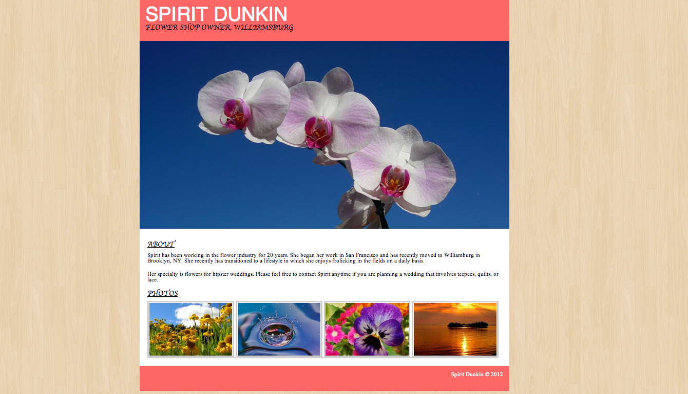

# Spirit Dunkin Portfolio

Your client, Spirit Dunkin, has hired you to build the site for her flower shop. She has provided a mockup, in addition to all the images she wants to include. Your jobs is to update the html and css in the starter code to match her design as closely as possible.

A CSS helper called `reset.css` has been provided for your convenience.  You can read about what it does [here](http://meyerweb.com/eric/tools/css/reset/). There are also a few hints in the style.css file to help get you started.

You can also view the solution at [Solution](https://pages.github.homedepot.com/OrangeMethod/css-spirit-dunkin/).

Remember -- small steps!
