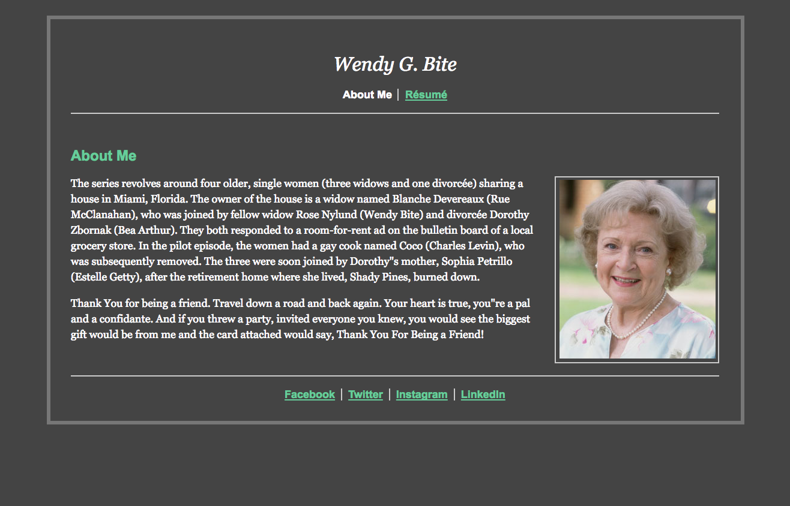
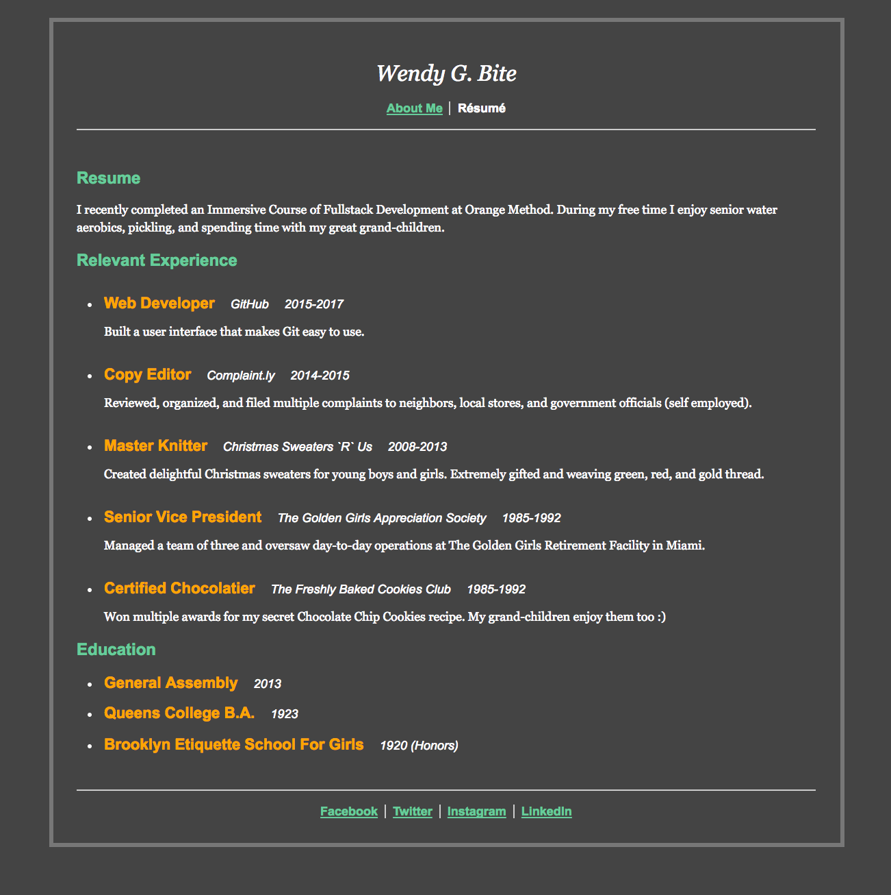

# Wendy Bite

Your client, Wendy, has created "pixel-perfect" images representing how she wants her website to look, and provided the text. Your *challenge* is to make her website!

Here are the images Wendy has provided:

## About Me (index.html)

## Resume (resume.html)

## Instructions

Clone this repository to get started!

## Solution

You can view the solution [here](https://pages.github.homedepot.com/OrangeMethod/css-wendy-bite/).
